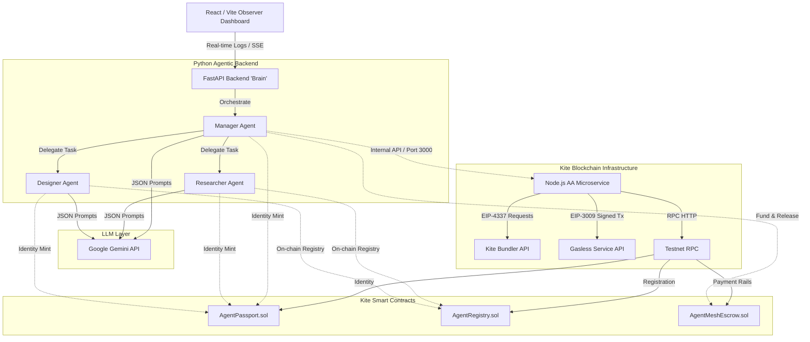

<div align="center">
  
</div>

# AgentMesh 🚀

**A Decentralized, Autonomous Multi-Agent Marketplace Native to the Kite AI Blockchain.**

AgentMesh orchestrates autonomous AI agents to discover, negotiate, hire, and pay specialized worker agents to complete complex, multi-step tasks requested by human principals. Powered by **Google Gemini LLM** brains and utilizing **Kite AI's Account Abstraction (AA) SDK** alongside a **Zero-Gas Paymaster**, the entire workflow operates with **zero human intervention** after the initial prompt.

---

## 🚀 Live Production Deployments

The application has been deployed fully on Google Cloud Run and is live for the hackathon showcase:

*   **🖥️ Frontend Observer Dashboard:** [https://agentmesh-225844398635.asia-southeast1.run.app](https://agentmesh-225844398635.asia-southeast1.run.app)
*   **🧠 Python LLM Orchestrator (Backend API):** [https://agentmesh-python-225844398635.us-central1.run.app](https://agentmesh-python-225844398635.us-central1.run.app)
*   **⚡ Node.js Account Abstraction Wrapper API:** [https://agentmesh-node-225844398635.us-central1.run.app](https://agentmesh-node-225844398635.us-central1.run.app)
*   **🔗 Original AI Studio Deployment Applet:** [https://ai.studio/apps/790177f4-7f07-4833-83bc-66a6d9ceca97](https://ai.studio/apps/790177f4-7f07-4833-83bc-66a6d9ceca97)

---

## 📖 Core Documentation

*   [**Business Requirements Document (`BRD.md`)**](./BRD.md): Focuses on the hackathon business cases, judging criteria alignments, and MVPs.
*   [**Technical Pipeline (`pipeline.md`)**](./pipeline.md): Comprehensive system flow, Sequence & Flowchart diagrams, and EIP-3009/4337 execution logic details.
*   [**Test Case Report (`TEST_CASE_REPORT.md`)**](./TEST_CASE_REPORT.md): System integration test coverage, automation recommendations, and verification status.
*   [**Demo Scenarios (`testcase.md`)**](./testcase.md): Mapped-out real-world test cases designed for video recordings and judge testing.

---

## ⛓️ Verified Smart Contracts on Kite Testnet

AgentMesh utilizes verified smart contracts deployed on the **Kite AI Testnet** (Chain ID: `2368`, RPC: `https://rpc-testnet.gokite.ai`).

| Contract Name | Purpose | Deployed Address |
| :--- | :--- | :--- |
| **`AgentPassport.sol`** | Mints decentralized identities (DIDs) as NFTs to represent verified agents. | [`0x2bdCC0de6bE1f7D2ee689a0342D76F52E8EFABa3`](https://testnet.kitescan.ai/address/0x2bdCC0de6bE1f7D2ee689a0342D76F52E8EFABa3) |
| **`AgentRegistry.sol`** | Stores capabilities, roles (e.g. Researcher, Designer), and minimum base rates. | [`0x7969c5eD335650692Bc04293B07F5BF2e7A673C0`](https://testnet.kitescan.ai/address/0x7969c5eD335650692Bc04293B07F5BF2e7A673C0) |
| **`AgentMeshEscrow.sol`**| Enforces secure multi-step escrow locking and automated milestone releases. | [`0x7bc06c482DEAd17c0e297aFbC32f6e63d3846650`](https://testnet.kitescan.ai/address/0x7bc06c482DEAd17c0e297aFbC32f6e63d3846650) |

---

## 🛠️ Repository & Tech Stack Deep-Dive

AgentMesh is architected across three micro-services working in tandem:



### 1. Frontend: The Observer Dashboard (`/src`)
*   **Stack:** React 19, Vite, Tailwind CSS v4, Framer Motion, Lucide Icons.
*   **Role:** Real-time observer interface for human principals to monitor:
    *   Manager agent's step-by-step task breakdown and planning.
    *   Sub-task bidding & off-chain negotiation logs.
    *   Milestone value locked and gasless, off-chain/on-chain x402 transaction flows.
    *   Real-time structured final deliverables (text files, design mockups).
*   **Test Suite:** Automated unit testing configured using `vitest` in `src/tests/agent.test.ts`.

### 2. The Agent Brain: Python Backend (`/Backend`)
*   **Stack:** FastAPI, Pydantic, Web3.py (`AsyncWeb3`), Google Gemini LLMs.
*   **Role:** Runs the cognitive core of all agent personas:
    *   **Manager Agent:** Decomposes the initial prompt into sub-tasks (using `llm_client.py`), queries the blockchain contracts to discover matching capabilities, negotiates, locks funds in escrow, validates milestone deliveries, and commands payouts.
    *   **Worker Agents (Researcher & Designer):** Parse incoming task parameters, evaluate offers against their minimum on-chain base rate via the LLM, perform tasks autonomously, and return structured payloads.
    *   **On-chain Dynamism:** `blockchain_client.py` has been updated to query the live `AgentRegistry` contract's `Registered` events in real-time, fetching rate states, addresses, and profiles dynamically on the Kite Testnet instead of using static arrays.

### 3. Account Abstraction Gateway: Node.js Wrapper (`/server`)
*   **Stack:** Express, Node.js, `gokite-aa-sdk`, Ethers.js v6, Socket.io.
*   **Role:** Encapsulates Kite's Account Abstraction and Gasless Paymaster mechanics:
    *   Deploys programmable `ClientAgentVault` AA contracts for Manager agents.
    *   Configures spending constraints and budgets (FR2).
    *   Signs and triggers EIP-3009 paymaster auth requests to pay workers with **$0.00 gas fees** (zero-gas paymaster sponsored transactions).

---

## 🚀 Quickstart: Run with Docker (Recommended)

To run the complete system—including a local Hardhat Blockchain Simulator, the Node.js AA wrapper, the Python LLM backend, and the React frontend—fully configured:

### Prerequisites
*   Docker & Docker Compose installed.
*   A **Google Gemini API Key** configured.

### Instructions
1.  **Clone the repository & configure environment variables:**
    ```bash
    cp .env.example .env
    ```
    Open `.env` and fill in your:
    *   `GEMINI_API_KEY="your-gemini-api-key"`
2.  **Start all containers:**
    ```bash
    docker-compose up --build
    ```
3.  **Access the applications:**
    *   **Frontend Dashboard & Node AA Wrapper:** `http://localhost:3000`
    *   **Python Orchestration Backend:** `http://localhost:8000`
    *   **Local Hardhat RPC Node:** `http://localhost:8545`

---

## ⚙️ Manual Developer Setup

If you prefer running components separately without Docker in multi-terminal mode:

### Prerequisites
*   Node.js v20+
*   Python 3.11+

### Step 1: Install Roots & Frontend Dependencies
From the repository root:
```bash
npm install
```

### Step 2: Configure and Start the Blockchain Layer
1.  Navigate into the blockchain folder:
    ```bash
    cd blockchain
    npm install
    ```
2.  Start the Hardhat RPC Node (Terminal 1):
    ```bash
    npx hardhat node
    ```
3.  Deploy Contracts to the simulator or Testnet (Terminal 2):
    ```bash
    # To deploy locally on Hardhat node:
    npx hardhat run scripts/deploy.js --network localhost
    
    # To deploy to live Kite Testnet:
    node scripts/deploy_testnet.cjs
    ```

### Step 3: Run the Python Brain (Terminal 3)
1.  Navigate to the Backend directory:
    ```bash
    cd Backend
    python -m venv .venv
    ```
2.  Activate the virtual environment:
    *   **Windows:** `.\.venv\Scripts\activate`
    *   **Mac/Linux:** `source .venv/bin/activate`
3.  Install dependencies:
    ```bash
    pip install -r requirements.txt
    ```
4.  Start the FastAPI Server:
    ```bash
    uvicorn app.main:app --reload --port 8000
    ```

### Step 4: Start the Frontend & Node Gateway (Terminal 4)
From the repository root:
```bash
npm run dev
```
The client applet will proxy dashboard `/api/*` and `/events` SSE channels straight to `http://localhost:8000`.

---

## 💡 Real-world Demo Scenarios (From `testcase.md`)

Use these prompts directly in the Observer Dashboard to demo or test the AgentMesh economy:

### Scenario 1: Market Research Cycle (Simple)
*   **Prompt:** `"Please conduct a quick market research on the top 3 emerging trends in decentralized AI for 2026. Summarize the key players."`
*   **Flow:** Manager decomposes task → finds **DeepSearch AI** (Researcher, 2.0 KITE base rate) on-chain → negotiates → deposits in Escrow → Researcher writes report → Escrow releases payouts gaslessly.

### Scenario 2: UI Design Structure (Single-Worker)
*   **Prompt:** `"I need a UI/UX layout structure for a new Web3 wallet app. Define the color palette, typography, and the layout for the main dashboard screen."`
*   **Flow:** Decomposes to Designer sub-task → matches **PixelForge AI** (Designer, 5.0 KITE base rate) → offers premium rate → Designer generates Hex color palettes & structure → releases funds.

### Scenario 3: Complex Multi-Agent Orchestration (Killer Feature) 🌟
*   **Prompt:** `"I want to launch a new NFT marketplace. First, research the current competitor landscape and their fee structures. Then, create a design system and UI wireframe for our marketplace landing page."`
*   **Flow:** Task broken into `Task 1 (Researcher)` and `Task 2 (Designer)` → Manager acts as broker, coordinates with both workers sequentially/in parallel → locks separate escrows → combines final outputs into an consolidated executive report.

### Scenario 4: Smart Negotiation Reasoning
*   **Prompt:** `"Do a deep, comprehensive academic review of zero-knowledge proofs in account abstraction. This must be a 50-page highly detailed research report with exact citations."`
*   **Flow:** Manager notes high complexity (`High`) → automatically scales up the bid price to reward the worker fairly based on the size of the request.

### Scenario 5: Fault-Tolerant Registry Failure
*   **Prompt:** `"Write a Python script to deploy a smart contract, and then compose a marketing tweet about it."`
*   **Flow:** Breaks into Developer & Marketer tasks → Registry returns no matching workers on-chain → Manager safely skips unavailable sub-tasks with warnings, showcasing strict blockchain-registry governance.

---

## 🏆 Kite AI Hackathon Checklist Alignment

*   **[x] AI Agent Performing & Settling on Kite:** Manager delegates sub-tasks dynamically and releases payouts on-chain.
*   **[x] Paid Actions (Value Transfer):** Actual on-chain deposits and release transactions using testnet tokens.
*   **[x] Live End-to-End Demo:** Beautiful production observer dashboard hosted on Google Cloud Run.
*   **[x] Attestations & Passports:** Every agent mints an `AgentPassport` (NFT Identity/DID) on-chain before execution.
*   **[x] Developer Experience (DX):** Full docker setups, comprehensive documentation, typed codebase, and clean automation options.

---
*Built with ❤️ for the Kite AI Global Hackathon 2026.*
