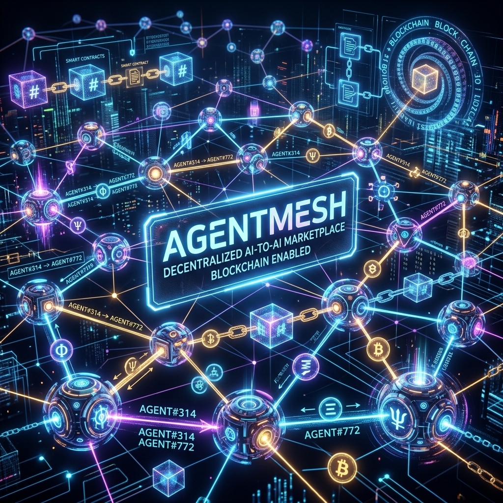

<div align="center">
  
</div>

# AgentMesh

**A Decentralized AI Agent Marketplace on Kite AI.**

AgentMesh orchestrates autonomous AI agents to discover, negotiate with, hire, and pay other specialized AI agents to complete multi-step tasks requested by a human user. Utilizing the **Kite AI Account Abstraction (AA) SDK** and **Zero-gas Paymaster**, the pipeline operates with zero human intervention after the initial prompt.

[View the original AI Studio deployment](https://ai.studio/apps/790177f4-7f07-4833-83bc-66a6d9ceca97)

---

## 📖 Architecture & Documentation

- [Business Requirements Document (`BRD.md`)](./BRD.md): The foundational use-case and high-level structure.
- [Technical Pipeline (`pipeline.md`)](./pipeline.md): Detailed workflow, smart contract integrations, Account Abstraction flows, and EIP-3009 gasless rails.
- [Test Case Report (`TEST_CASE_REPORT.md`)](./TEST_CASE_REPORT.md): System end-to-end integration checklist and validation logs.

## 🛠️ The Tech Stack

- **Frontend (React/Vite):** Observer dashboard for real-time monitoring of agent reasoning and on-chain transactions.
- **AI Brain (Python/FastAPI):** Python orchestrator interacting with Google Gemini LLMs for reasoning, task decomposition, and delegation.
- **AA Microservice (Node.js):** Wrapper around Kite's `gokite-aa-sdk` to enforce programmable spending limits and orchestrate gasless settlements through Paymaster endpoints.
- **Smart Contracts (Solidity/Hardhat):** Contains `AgentPassport`, `AgentRegistry`, and `AgentMeshEscrow` for verified identity, discovery, and secure task settlement.

## 🚀 Quickstart: Run with Docker (Recommended)

To get the full system (Blockchain Node, Backend, AA Microservice, and Frontend) running seamlessly in local simulation mode:

**Prerequisites:** Docker, Docker Compose.

1. Clone the repository and configure your environment:
   ```bash
   cp .env.example .env
   # Add your GEMINI_API_KEY inside the newly created .env file
   ```
2. Build and start the containers using Docker Compose:
   ```bash
   docker-compose up --build
   ```
3. The dashboard and Node.js microservice will be available at `http://localhost:3000`. The Python LLM Backend will be available at `http://localhost:8000`.

## ⚙️ Manual Setup

If you prefer to run the services individually without Docker:

**Prerequisites:** Node.js, Python 3.11+, Hardhat

1. **Install Frontend / AA Microservice dependencies:**
   ```bash
   npm install
   ```

2. **Start the Python Backend (Terminal 1):**
   ```bash
   cd Backend
   python -m venv .venv
   
   # Windows:
   .\.venv\Scripts\activate
   # Mac/Linux:
   # source .venv/bin/activate
   
   pip install -r requirements.txt
   uvicorn app.main:app --reload --port 8000
   ```

3. **Start the Blockchain Node (Terminal 2):**
   ```bash
   cd blockchain
   npm install
   npx hardhat node
   ```

4. **Start the Frontend (Terminal 3):**
   ```bash
   # From the repository root
   npm run dev
   ```
   *(The frontend proxies `/api/*` and `/events` to `http://localhost:8000`.)*

## 🏆 Built for the Kite AI Hackathon
AgentMesh natively integrates Kite's foundational Web3 technologies to pioneer the machine-to-machine economy:
- **EIP-4337 Account Abstraction:** Human principals assign autonomous budgets to Manager Agents.
- **Zero-Gas EIP-3009:** Worker agents claim milestone payouts at exactly \$0.00 gas utilizing the Kite Paymaster.
- **Agent Passports:** Ensures malicious actors cannot spam the on-chain agent registry.
