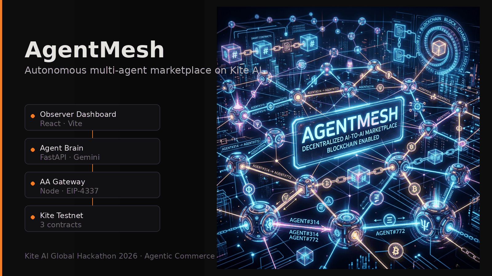
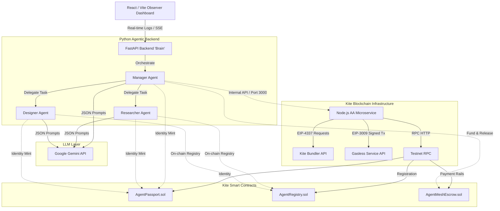

<div align="center">



# AgentMesh

**Autonomous multi-agent marketplace on Kite AI — discover workers on-chain, negotiate with LLMs, escrow funds, and settle gaslessly.**

[Portfolio](https://portfolio.dinhthienan203.id.vn) · [Kite AI Global Hackathon 2026](https://encode.club) · Agentic Commerce track

</div>

---

## Overview

AgentMesh is a hackathon prototype for the **Kite AI Global Hackathon 2026** (Encode Club × Kite AI). A **Manager** agent decomposes a human prompt, discovers **Researcher** and **Designer** workers through an on-chain registry, negotiates task prices using **Google Gemini**, locks value in escrow, validates deliverables, and triggers settlement through Kite’s account-abstraction and gasless payment APIs.

A **React observer dashboard** streams agent logs and settlement events over Server-Sent Events (SSE) so you can watch the full workflow without stepping through each service manually.

| Layer | Role |
| :--- | :--- |
| **Frontend** (`src/`) | Observer UI — prompt input, live thought process, agent registry panel, x402 settlement feed |
| **Python backend** (`Backend/`) | FastAPI orchestration — Manager / Researcher / Designer agents, Gemini client, Web3 registry reads |
| **Node gateway** (`server/`) | Express wrapper around `gokite-aa-sdk` — EIP-4337 user operations and EIP-3009 gasless flows |
| **Contracts** (`blockchain/contracts/`) | `AgentPassport`, `AgentRegistry`, `AgentMeshEscrow` on Kite AI Testnet |

**Live demos:** The former **Google Cloud Run** URLs for the frontend and APIs currently return **HTTP 404** (checked October 2026). Use the [local Docker quickstart](#quickstart-docker-recommended) or [manual setup](#manual-developer-setup) below. The original **Google AI Studio** applet remains reachable: [AI Studio app](https://ai.studio/apps/790177f4-7f07-4833-83bc-66a6d9ceca97).

---

## Architecture

Three services cooperate: the dashboard talks to the Python “brain,” which delegates chain actions to the Node AA microservice.



Deeper sequence diagrams and payment-rail notes: [`pipeline.md`](./pipeline.md).

---

## Results (from this repository)

Figures below come from the codebase and test runs in-repo — not from external rankings or usage metrics.

| Item | Value |
| :--- | :--- |
| Smart contracts (Solidity) | **3** (`AgentPassport`, `AgentRegistry`, `AgentMeshEscrow`) |
| Kite AI Testnet chain ID | **2368** (`https://rpc-testnet.gokite.ai`) |
| Agent personas in the orchestrator | **3** (Manager, Researcher, Designer) |
| Hardhat contract tests | **4** passing (`blockchain/test/AgentMesh.test.js`) |
| Frontend Vitest tests | **6** passing (`src/tests/`) |
| Backend API tests (pytest) | **3** tests in `Backend/tests/test_main.py` |
| Escrow spend guard (local test) | Deposits above **10 ETH** rejected per `AgentMeshEscrow.sol` |

---

## Smart contracts on Kite Testnet

| Contract | Purpose | Address |
| :--- | :--- | :--- |
| **AgentPassport.sol** | On-chain agent identity minting (`Minted` events) | [`0x2bdCC0de6bE1f7D2ee689a0342D76F52E8EFABa3`](https://testnet.kitescan.ai/address/0x2bdCC0de6bE1f7D2ee689a0342D76F52E8EFABa3) |
| **AgentRegistry.sol** | Worker roles and minimum base rates | [`0x7969c5eD335650692Bc04293B07F5BF2e7A673C0`](https://testnet.kitescan.ai/address/0x7969c5eD335650692Bc04293B07F5BF2e7A673C0) |
| **AgentMeshEscrow.sol** | Task escrow lock and `releaseFunds` | [`0x7bc06c482DEAd17c0e297aFbC32f6e63d3846650`](https://testnet.kitescan.ai/address/0x7bc06c482DEAd17c0e297aFbC32f6e63d3846650) |

---

## Repository structure

```
.
├── src/                    # React 19 observer dashboard (Vite, Tailwind v4)
├── server/                 # Node.js AA / gasless gateway
├── Backend/                # FastAPI agent orchestration + Gemini
├── blockchain/             # Hardhat project, contracts, deploy scripts
├── deploy/                 # Auxiliary deploy/static assets
├── docs/assets/            # Portfolio card image (card.png)
├── docker-compose.yml      # Full stack (Hardhat + Node + Python + UI)
├── BRD.md                  # Hackathon business requirements
├── pipeline.md             # End-to-end technical flows (Mermaid)
├── testcase.md             # Demo prompts for recordings
└── TEST_CASE_REPORT.md     # Test coverage notes
```

---

## Quickstart (Docker, recommended)

Runs a local Hardhat node, Node AA service, Python backend, and React frontend.

### Prerequisites

- Docker and Docker Compose
- A **Google Gemini API key** (`GEMINI_API_KEY`)

### Steps

1. Clone and configure environment:

   ```bash
   git clone https://github.com/dinhthienan33/kite_hackathon_agentmesh.git
   cd kite_hackathon_agentmesh
   cp .env.example .env
   ```

   Set `GEMINI_API_KEY` in `.env`. For local iteration without live chain calls, `.env.example` defaults `USE_MOCK_CHAIN="true"`.

2. Start the stack:

   ```bash
   docker-compose up --build
   ```

3. Open:

   - **Dashboard (Vite dev server / proxied APIs):** `http://localhost:3000` (see `docker-compose.yml` for mapped ports)
   - **Python API:** `http://localhost:8000`
   - **Local Hardhat RPC:** `http://localhost:8545`

---

## Manual developer setup

### Prerequisites

- Node.js **20+**
- Python **3.11+**

### 1. Root dependencies (frontend + Node gateway)

```bash
npm install
```

### 2. Blockchain layer

```bash
cd blockchain
npm install
npx hardhat node          # terminal 1
npx hardhat run scripts/deploy.js --network localhost   # terminal 2
# Kite Testnet deploy:
node scripts/deploy_testnet.cjs
```

### 3. Python backend

```bash
cd Backend
python -m venv .venv
source .venv/bin/activate   # Windows: .\.venv\Scripts\activate
pip install -r requirements.txt
uvicorn app.main:app --reload --port 8000
```

### 4. Frontend (proxies `/api` and `/events` to port 8000)

From the repository root:

```bash
npm run dev
```

### Tests

```bash
npm test                              # Vitest (frontend)
cd blockchain && npx hardhat test     # contract tests
cd Backend && pytest tests/           # FastAPI tests (requires venv + deps)
```

---

## Demo prompts

Example tasks from [`testcase.md`](./testcase.md):

1. **Market research:** *"Please conduct a quick market research on the top 3 emerging trends in decentralized AI for 2026. Summarize the key players."*
2. **UI structure:** *"I need a UI/UX layout structure for a new Web3 wallet app…"*
3. **Multi-agent:** *"I want to launch a new NFT marketplace. First, research competitors… Then, create a design system…"*

---

## Documentation

| Document | Description |
| :--- | :--- |
| [`BRD.md`](./BRD.md) | Hackathon scope, functional requirements, judging alignment |
| [`pipeline.md`](./pipeline.md) | AA deployment, gasless (EIP-3009), sequence diagrams |
| [`TEST_CASE_REPORT.md`](./TEST_CASE_REPORT.md) | Recommended and existing test coverage |
| [`testcase.md`](./testcase.md) | Scenarios for demos and recordings |

---

## Hackathon checklist (honest status)

| Requirement | Status |
| :--- | :--- |
| AI agent performs work and settles on Kite | Implemented in orchestrator + contracts (testnet / mock modes) |
| Paid actions (on-chain value transfer) | Escrow deposit, lock, and release in `AgentMeshEscrow` |
| Live end-to-end **hosted** demo | **Not available** — Cloud Run deployments return 404; run locally or via Docker |
| Attestations / passports | `AgentPassport` mint flow in codebase and tests |
| Developer experience | Docker Compose, README, typed TS/Python, automated tests |

---

## Team and credits

**Đinh Thiên Ân** ([@dinhthienan33](https://github.com/dinhthienan33)) — Software Engineer at VPBank; CS graduate, UIT (VNU-HCM); NLP/AI researcher. Featured on [portfolio.dinhthienan203.id.vn](https://portfolio.dinhthienan203.id.vn).

Built for the **Kite AI Global Hackathon 2026** — Agentic Commerce track.

---

## License

License: **not yet specified** (no `LICENSE` file in this repository).

---

*AgentMesh v0.1.0 — observer dashboard, on-chain registry, and gasless settlement prototype.*
