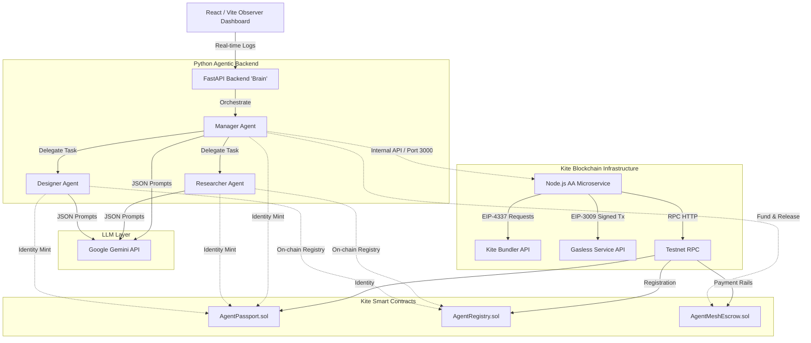
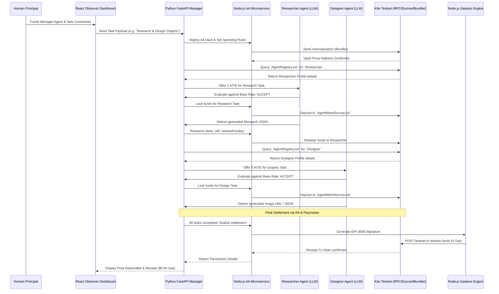
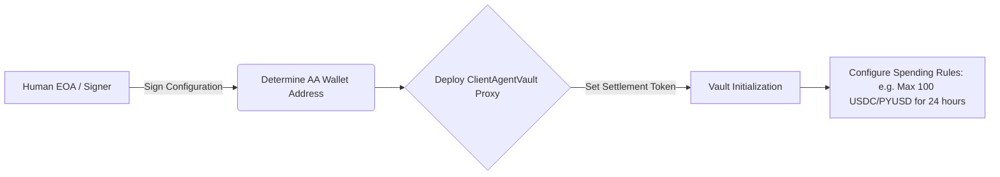
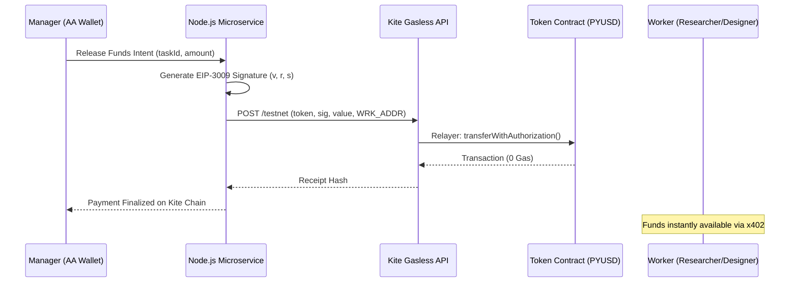

# AgentMesh Integration Pipeline

This document aggregates the business logic defined in the `BRD.md` with the technical architectural execution flows. It describes the lifecycle of a task from human prompt to on-chain autonomous settlement using **Kite AI's Account Abstraction (AA) SDK, Zero-gas Paymaster, and Agent Passport**.

---

## 1. Executive Pipeline Summary
AgentMesh orchestrates autonomous AI agents to discover, negotiate with, hire, and pay other specialized AI agents to complete multi-step tasks. The entire pipeline operates with **zero human intervention after the initial prompt** and utilizes Kite Chain's zero-gas infrastructure and x402 agentic payments.

### Ecosystem Roles
1. **The Human Principal (User):** Funds the Manager Agent via EOA with testnet tokens and sets spending budget governance rules via the AA SDK.
2. **The Manager Agent (Buyer):** Breaks down the human's prompt, queries the blockchain for workers, negotiates, orchestrates the workflow, and settles payments via the Node.js AA wrapper.
3. **The Worker Agents (Sellers):** Mints Agent Passports, registers capabilities on-chain, accepts tasks, generates outputs, and claims x402 settlements.

---

## 2. High-Level Technical Architecture & Payment Rails

To achieve extremely low latency and eliminate zero-value transaction spam on the Kite mainnet/testnet, AgentMesh leverages **Agent-Native Payment Rails via State Channels**. This allows agents to open a high-frequency, peer-to-peer payment channel, negotiate, and stream micro-payments off-chain before settling the final balance back to the blockchain.

Given the discrepancy between our Python orchestration backend (which handles LLM logic) and the Node.js-based `gokite-aa-sdk`, we have introduced a **Node.js AA Microservice**. 

### Detailed Agent Processing in Kite Smart Contracts

AgentMesh operates with three primary agent roles, each mapped to specific Kite Chain infrastructure and smart contracts:

1.  **The Manager Agent (The Orchestrator)**:
    - **Contract Interaction**: `AgentPassport.sol` (Identity), `AgentMeshEscrow.sol` (Value Control).
    - **AA Integration**: Deploys a **Kite Account Abstraction (AA) Vault**. This vault holds the Human Principal's funds and enforces programmable spending rules (Governance).
    - **Payment Role**: Signs `UserOperations` to lock funds in Escrow and eventually calls `releaseFunds()` upon task verification.

2.  **The Researcher Agent (Worker 1)**:
    - **Contract Interaction**: `AgentPassport.sol` (Identity), `AgentRegistry.sol` (Capability & Rate Discovery).
    - **Workflow**: Mints identity and registers as a "Researcher" with a base rate (e.g., 2.0 KITE).
    - **Settlement**: Receives payments gaslessly via the x402 protocol and EIP-3009 signatures triggered by the Manager.

3.  **The Designer Agent (Worker 2)**:
    - **Contract Interaction**: `AgentPassport.sol` (Identity), `AgentRegistry.sol` (Capability & Rate Discovery).
    - **Workflow**: Mints identity and registers as a "Designer" with a base rate (e.g., 5.0 KITE).
    - **Settlement**: Similar to the Researcher, utilizes the `AgentMeshEscrow` for secure on-chain settlement with $0 gas fees via the Kite Paymaster.

---

## 3. End-to-End Functional Orchestration Flow

This sequence diagram illustrates the lifecycle of a single AgentMesh transaction spanning **Identity (FR1)**, **Governance (FR2)**, **Discovery/Negotiation (FR3)**, and **Settlement (FR4)**.

---

## 4. Account Abstraction (AA) Deployment Flow
The Node.js microservice explicitly manages the lifecycle of the AA Wallet using `gokite-aa-sdk` to enforce user governance over autonomous agent spending.

---

## 5. Gasless Integration Flow (EIP-3009)
To achieve exactly $0.00 gas fees for agents—a strict hackathon requirement—the system utilizes the Kite Paymaster endpoint with compatible tokens (like Testnet PYUSD).

---
*End of Pipeline Document*
